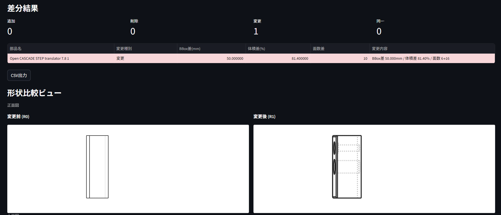

# Dokocawa — STEP File Diff Checker

A free desktop tool for mechanical designers to compare two STEP files and detect what changed between design revisions.

## Features

- **Part-level diff** — Detects added, removed, and modified parts automatically
- **Geometry diff** — Reports bounding-box (BBox), volume, and face-count differences per part
- **3D viewer** — Click a part in the diff table to highlight it in the 3D view
- **DfM warnings** — Flags thin walls, deep holes, and sharp edges
- **Spec check** — Cross-references STEP dimensions against a PDF spec sheet
- **CSV / Excel export**

## Highlights

| | |
|:--|:--|
| Price | Free |
| Executable size | ~30 MB single `.exe` |
| Installation | Not required (ZIP version runs as-is) |
| Network | Offline — no data leaves your machine |
| Platform | Windows 10 / 11 |

Safe for confidential CAD data. No cloud upload, no account required.

## Download

[GitHub Releases](https://github.com/FabGear-JP/docokawa/releases/latest)

## Screenshot

---

# ドコカワ

STEPファイルの差分比較ツール — 設変前後の変更箇所を自動検出
